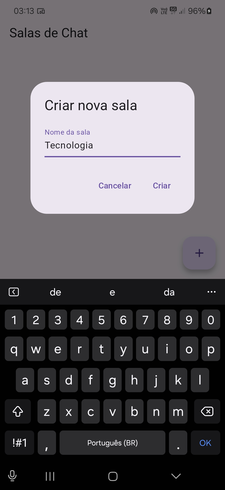
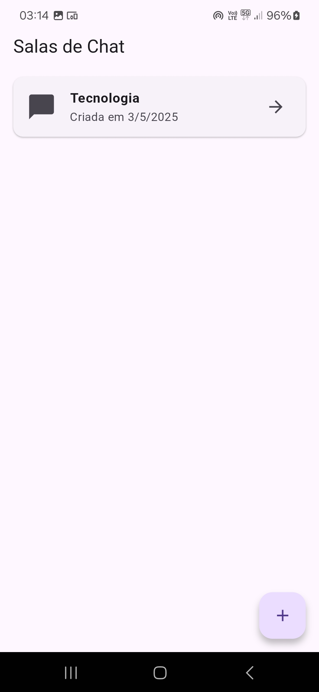
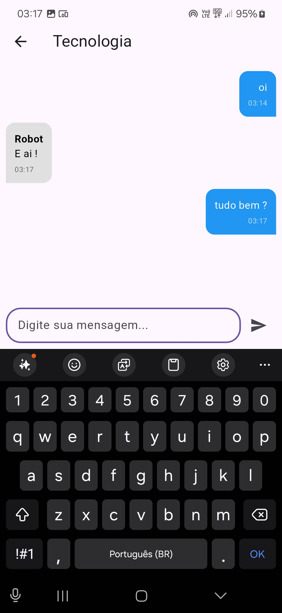
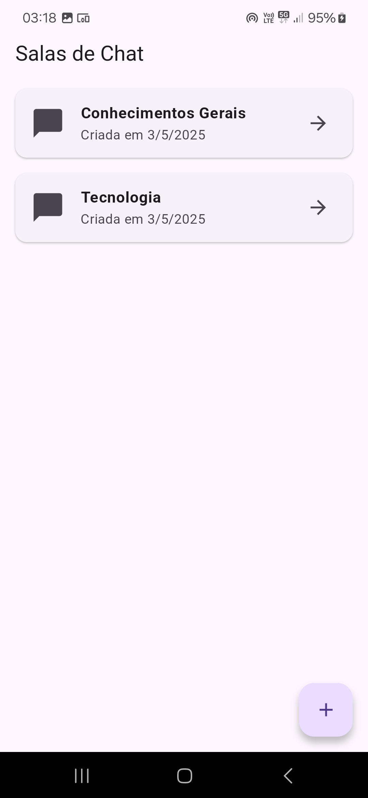

# 📱 Flutter Firebase Chat App
Um aplicativo de chat em tempo real desenvolvido com Flutter e Firebase, permitindo a criação de salas de chat e troca de mensagens entre usuários.

## Screenshots 
<p align="center">
  
  
  
  
</p>

## Índice
- [Funcionalidades](#funcionalidades)
- [Tecnologias](#tecnologias-utilizadas)
- [Estrutura do Banco de Dados](#estrutura-do-banco-de-dados-firestore)
- [Regras de Segurança](#regras-de-segurança-do-firestore)
- [Telas do Aplicativo](#telas-do-aplicativo)
- [Estrutura do Projeto](#estrutura-do-projeto)
- [Como Executar](#como-executar-o-projeto)

## Funcionalidades

- ✅ Autenticação anônima
- ✅ Criação de salas de chat
- ✅ Chat em tempo real com Firestore
- ✅ Mensagens alinhadas (direita para o usuário, esquerda para outros)
- ✅ Interface responsiva
- ✅ Suporte offline básico

## Tecnologias Utilizadas

| Tecnologia          | Versão    | Uso                              |
|---------------------|-----------|----------------------------------|
| Flutter             | 3.x       | Framework principal              |
| Firebase Auth       | ^4.6.0    | Autenticação de usuários         |
| Cloud Firestore     | ^4.8.0    | Banco de dados em tempo real     |
| Provider           | ^6.0.5    | Gerenciamento de estado          |
| intl               | ^0.18.1   | Formatação de datas/horas        |

## Estrutura do Banco de Dados (Firestore)

### Diagrama do Firestore
```sh
/rooms (coleção)
├── {roomId} (documento)
│ ├── name: string
│ ├── createdAt: timestamp
│ │
│ └── messages (subcoleção)
│ ├── {messageId} (documento)
│ │ ├── text: string
│ │ ├── senderId: string
│ │ ├── senderName: string
│ │ └── sentAt: timestamp
```

### Modelo para documentos

**Coleção `rooms`:**
```json
{
  "name": "Nome da Sala",  // string (obrigatório)
  "createdAt": timestamp,  // timestamp (automático)
  // Subcoleção 'messages' contendo:
  "messages": []           // array de mensagens
}
```
Subcoleção messages:
```json
{
  "text": "Conteúdo da mensagem",  // string (obrigatório)
  "senderId": "ID_do_usuário",     // string (obrigatório)
  "senderName": "Nome do usuário", // string (obrigatório)
  "sentAt": timestamp             // timestamp (automático)
}
```

## Regras de Segurança do Firestore
```sh
rules_version = '2';
service cloud.firestore {
  match /databases/{database}/documents {
    // Permissões para salas
    match /rooms/{room} {
      allow read: if true;  // Todos podem ler salas
      allow create: if request.auth != null;  // Só usuários autenticados criam
      
      // Permissões para mensagens
      match /messages/{message} {
        allow read: if true;  // Todos podem ler mensagens
        allow create: if request.auth != null;  // Só usuários autenticados enviam
      }
    }
  }
}
```

## Telas do Aplicativo
```sh
| Tela	        | Descrição	                                    | Componentes Principais
|---------------|-----------------------------------------------|-----------------------------------
| Splash Screen	| Tela inicial com verificação de autenticação	| CircularProgressIndicator
| Auth Screen	| Tela de autenticação anônima	                | ElevatedButton,Firebase Auth
| Room Screen	| Listagem de salas disponíveis	                | ListView, FloatingActionButton
| Chat Screen	| Tela de conversa em tempo real	            | StreamBuilder, TextField, ListView
```
## Estrutura do Projeto
```sh
lib/
├── main.dart                # Ponto de entrada
├── models/
│   ├── message.dart         # Modelo de mensagem
│   └── room.dart            # Modelo de sala
├── providers/
│   ├── auth_provider.dart   # Gerenciamento de autenticação
│   └── chat_provider.dart   # Lógica do chat
├── screens/
│   ├── auth_screen.dart     # Tela de login
│   ├── chat_screen.dart     # Tela de chat
│   ├── room_screen.dart     # Tela de salas
│   └── splash_screen.dart   # Tela inicial
└── widgets/
    ├── chat_bubble.dart     # Widget de mensagem
    └── message_input.dart   # Campo de entrada
```
## Como Executar o Projeto
Pré-requisitos
    - Flutter SDK (versão 3.x)
    - Conta no Firebase
    - Dispositivo/Emulador configurado

```sh
flutter clean
flutter pub get
flutter run
```

